# 🖥️ RISC-V Reference SoC Tapeout Program — VSD  
> *A Week-by-Week Logbook of My Journey from RTL to GDSII*  
> 🇮🇳 Part of India’s Largest Collaborative RISC-V Tapeout Initiative (3500+ Participants)

  
  

---

## 📖 Table of Contents

- [🎯 Program Overview](#-program-overview)
- [🔧 Design Flow](#-design-flow)
- [📅 Week 0 — Setup & Tools](#-week-0--setup--tools)
- [📦 Tools Installed](#-tools-installed)
- [🌟 Key Learnings](#-key-learnings)
- [📈 Program Objectives & Scope](#-program-objectives--scope)
- [🙏 Acknowledgments](#-acknowledgments)
- [📊 Weekly Progress Tracker](#-weekly-progress-tracker)
- [🚀 Next Steps](#-next-steps)

---

## 🎯 Program Overview

This repository documents my end-to-end journey through the **VSD RISC-V SoC Tapeout Program**, capturing weekly milestones, challenges, tools used, and key learnings — from RTL design to GDSII generation.

This initiative is a cornerstone of **India’s semiconductor renaissance**, uniting 3500+ engineers, students, and researchers to tape out open-source RISC-V SoCs using **100% open-source EDA tools**. I thank **Mr. Kunal Ghosh** and the team of **VLSI System Design (VSD)** for conducting such a grand event.

---

## 🔧 Design Flow

```mermaid
graph LR
  A[📝 RTL Design] --> B[🔄 Synthesis]
  B --> C[🏗️ Physical Design]
  C --> D[🎯 GDSII Tapeout]
```

> 💡 *All stages executed using open-source tools: Yosys → OpenLane → Magic → KLayout*

---

## 📅 Week 0 — Setup & Tools  
### 🛠️ Foundation Week: Environment & EDA Toolchain Setup

> *“A solid foundation ensures a stable skyscraper.”*

This week focused on installing, configuring, and verifying the complete open-source EDA stack required for the RTL-to-GDSII flow — including Dockerized OpenLane for automated PnR.

---

### ✅ Tasks Completed

| Task ID | Description               | Tools Involved         | Status     |
|---------|---------------------------|------------------------|------------|
| W0-T0   | Full EDA Toolchain Setup  | Yosys, Iverilog, Magic, OpenLane, Docker | ✅ DONE |

---

## 📦 Tools Installed

### 🧰 Core RTL & Synthesis Tools

| Tool         | Purpose                          | Status       | Verification Command       |
|--------------|----------------------------------|--------------|-----------------------------|
| 🧠 **Yosys**   | RTL Synthesis & Optimization     | ✅ Installed | `yosys -V`                  |
| 📟 **Iverilog**| Verilog Simulation               | ✅ Installed | `iverilog -v`               |
| 📊 **GTKWave** | Waveform Visualization           | ✅ Installed | GUI launch test             |
| ⚡ **Ngspice** | Analog/Mixed-Signal Simulation   | ✅ Installed | `ngspice -v`                |
| 🎨 **Magic**   | Layout Editor & DRC              | ✅ Installed | `magic -v`                  |

### 🚀 Advanced Flow & Automation

| Tool          | Purpose                         | Status       | Notes                       |
|---------------|---------------------------------|--------------|-----------------------------|
| 🐳 **Docker**   | Containerization & Isolation    | ✅ Installed | Required for OpenLane       |
| 🌊 **OpenLane**| Automated RTL-to-GDSII Flow     | ✅ Installed | Verified via `./flow.tcl`   |

---

## 🌟 Key Learnings — Week 0

- ✅ Mastered installation of complex open-source EDA toolchains on Ubuntu/VM.
- ✅ Validated interoperability between Yosys, Iverilog, and GTKWave for basic RTL sim.
- ✅ Successfully launched Magic and imported sample layouts — confirmed DRC readiness.
- ✅ Dockerized OpenLane environment configured and smoke-tested.
- ⚙️ Optimized VM specs: 8+ cores, 16GB+ RAM, 100GB+ storage for heavy PnR workloads.

> 💬 *“Setting up the environment is 30% of the battle — the rest is perseverance and debugging.”*

---

## 📈 Program Objectives & Scope

| Category           | Detail                                                                 |
|--------------------|------------------------------------------------------------------------|
| **🎓 Learning Path** | RTL → Synthesis → Floorplanning → Placement → Routing → DRC/LVS → GDSII |
| **🛠️ Tools Used**    | Yosys, OpenLane, Magic, Iverilog, GTKWave, Ngspice, KLayout            |
| **🏭 Industry Relevance** | Mirrors real-world ASIC tapeout flows using open-source alternatives   |
| **🤝 Collaboration** | Part of India’s national RISC-V movement — 3500+ strong                |
| **📈 Scale**         | Multi-university, multi-company, pan-India silicon initiative          |
| **🇮🇳 National Impact** | Building domestic capability in semiconductor design & tapeout         |

---

## 🙏 Acknowledgments

> A heartfelt thank you to:

### 🏆 Leadership & Mentorship

- **Kunal Ghosh** — Founder, VLSI System Design (VSD)  
- **Team VSD** — For architecting this groundbreaking educational initiative  
- **The OpenROAD Project & Efabless** — For powering the open-source ASIC revolution

> *“Alone we can do so little; together we can tape out a chip.”*

---

## 📊 Weekly Progress Tracker (Collapsible)

▶️ Click to Expand Weekly Tracker (WIP)

| Week | Focus Area         | Status     | Deliverables                          |
|------|--------------------|------------|----------------------------------------|
| 0    | Environment Setup  | ✅ Complete | Verified toolchain, Docker, OpenLane   |
| 1    | RTL Design         | ⏳ Pending  | Core module, testbench                 |
| 2    | Synthesis          | ⏳ Pending  | Yosys script, netlist, area report     |
| 3    | Floorplanning      | ⏳ Pending  | DEF, Floorplan config                  |
| 4    | Placement & Routing| ⏳ Pending  | OpenLane run, congestion analysis      |
| 5    | DRC/LVS            | ⏳ Pending  | Magic/KLayout verification             |
| 6    | GDSII & Tapeout    | ⏳ Pending  | Final GDS, documentation, submission   |

> *Tracker auto-updates weekly — stay tuned!*

