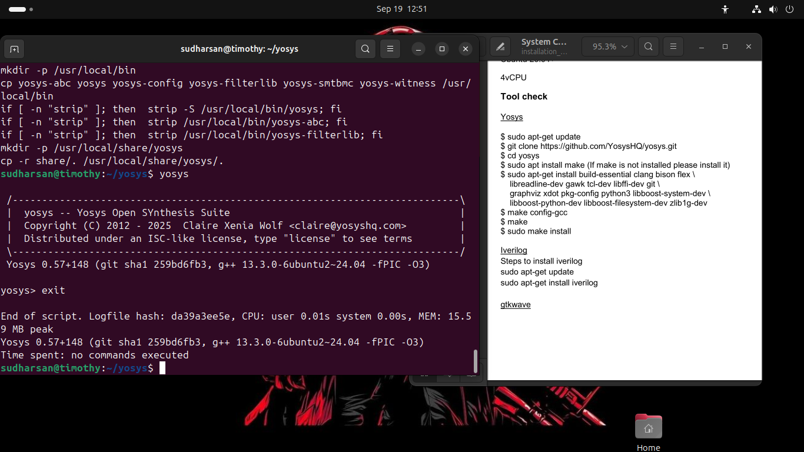
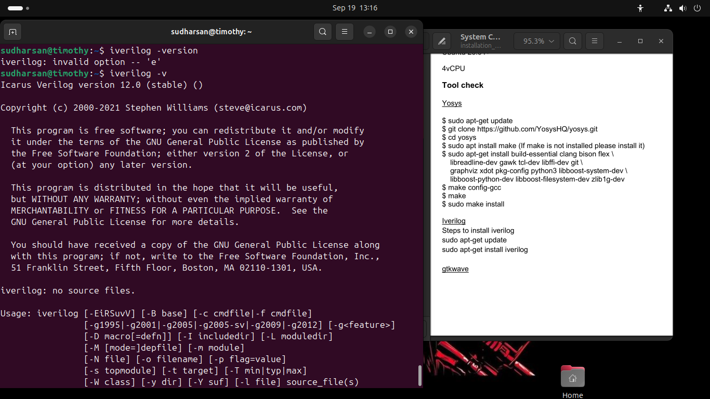
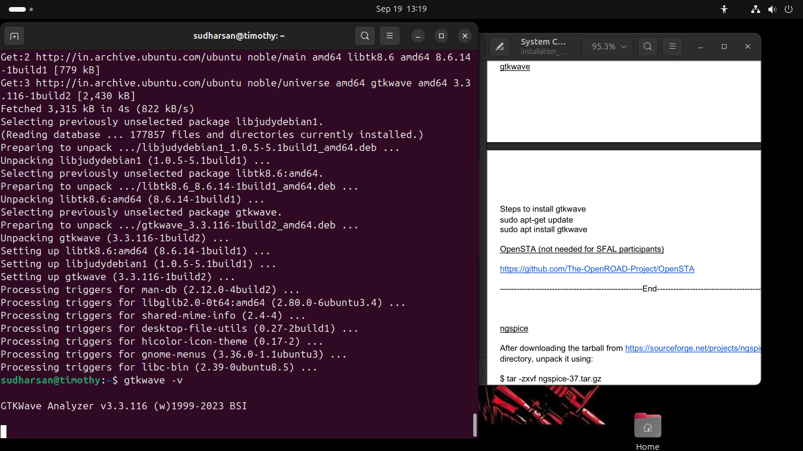
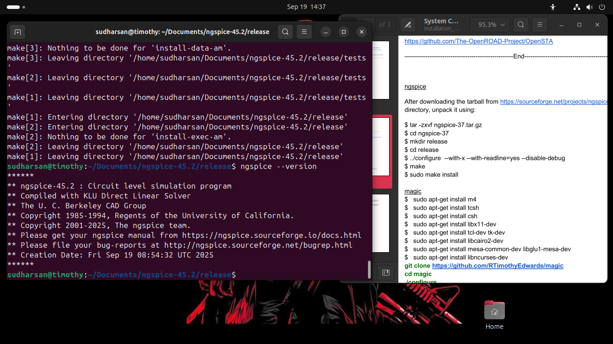
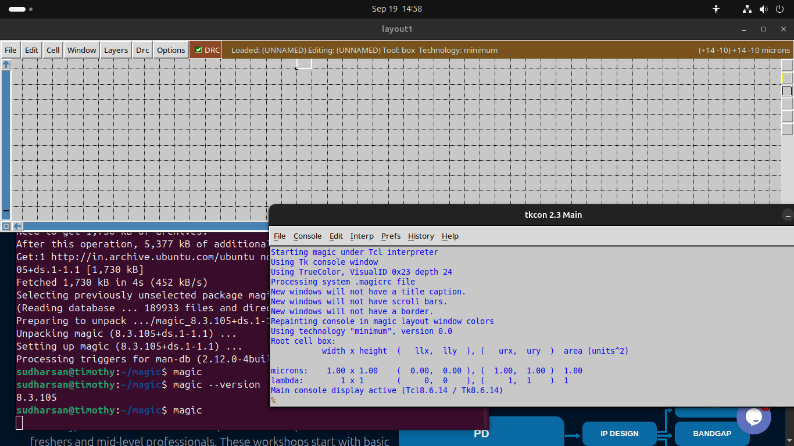
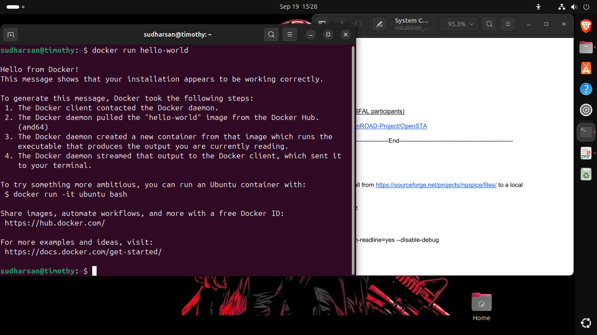
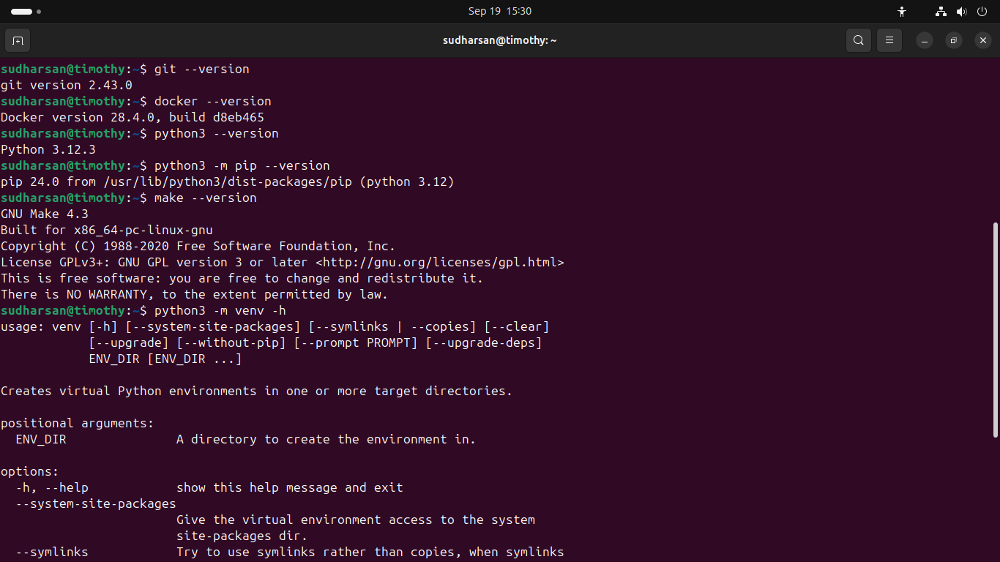

## WEEK 0 ##

Welcome to my **VLSI System Design (VSD) Program** repository! This week focused on building a **robust development environment** by installing and verifying essential open-source EDA tools required for the full **RTL → GDSII flow**.

🎯 Goals:
- Configure a high-performance VM
- Install and verify core EDA tools
- Prepare for synthesis, simulation, layout, and tapeout

---

## 💻 System & Virtual Machine Configuration

To ensure smooth performance during synthesis and physical design, I configured a dedicated **Ubuntu-based Virtual Machine** with the following specs:

| Specification | Details |
|---------------|--------|
| 🐧 OS          | Ubuntu 20.04+ |
| 💾 RAM         | 6 GB |
| 💿 Storage     | 50 GB HDD |
| ⚡ vCPUs       | 4 |

---

## ⚙️ Tool Installation & Verification

### 🧠 1. Yosys – RTL Synthesis Suite

**Purpose**: Convert Verilog RTL into gate-level netlists.

```bash
git clone https://github.com/YosysHQ/yosys.git
cd yosys
sudo apt install make build-essential clang bison flex libreadline-dev gawk tcl-dev libffi-dev git graphviz xdot pkg-config python3 libboost-system-dev libboost-python-dev libboost-filesystem-dev zlib1g-dev
make && sudo make install
```

#### ✅ Installation Verification



---

### 📟 2. Iverilog – Verilog Simulator

**Purpose**: Compile and simulate Verilog designs for functional verification.

```bash
sudo apt-get update && sudo apt-get install iverilog
```

#### ✅ Installation Verification



---

### 📊 3. GTKWave – Waveform Viewer

**Purpose**: Visualize simulation waveforms for debugging.

```bash
sudo apt update && sudo apt install gtkwave
```

#### ✅ Installation Verification



---

### ⚡ 4. Ngspice – Mixed-Signal Circuit Simulator

**Purpose**: Simulate analog and mixed-signal circuits.

```bash
sudo apt update && sudo apt install ngspice
```

#### ✅ Installation Verification



---

### 🎨 5. Magic VLSI – Layout Editor & DRC

**Purpose**: Create, edit, and verify IC layouts with DRC support.

```bash
git clone https://github.com/RTimothyEdwards/magic
cd magic
./configure
make && sudo make install
```

#### ✅ Installation Verification



---

### 🐳 6. Docker – Containerization Platform

**Purpose**: Run OpenLane and other tools in isolated environments.

```bash
sudo apt update && sudo apt install docker.io
sudo usermod -aG docker $USER
newgrp docker
docker run hello-world
```

#### ✅ Installation Verification



---

### 🌊 7. OpenLane – Full RTL-to-GDSII Flow

**Purpose**: Automate synthesis, placement, routing, and DRC.

```bash
cd $HOME
git clone https://github.com/The-OpenROAD-Project/OpenLane
cd OpenLane
make
make test
```
---

### 🌊 8. Version Details


